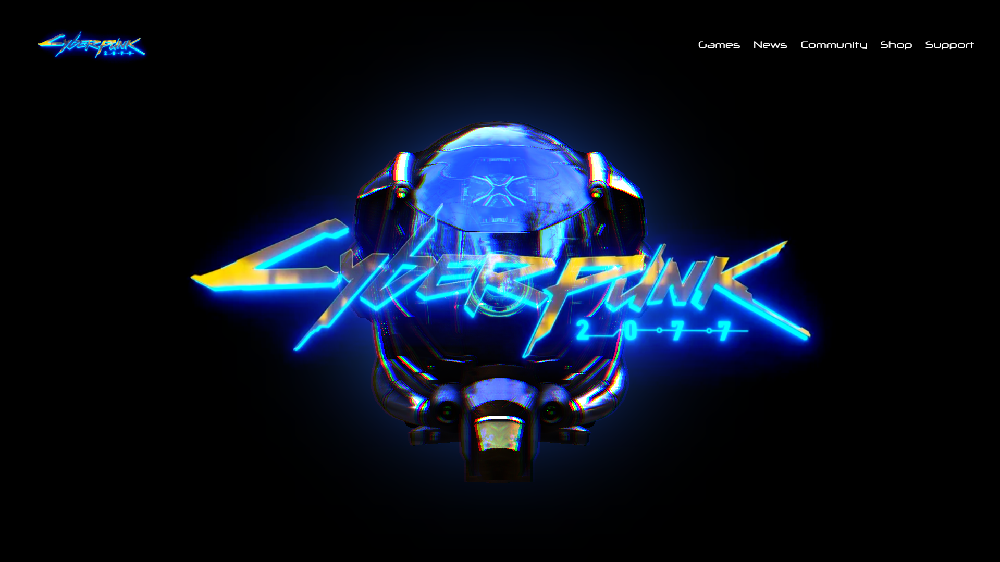

# ⚡ Cyberpunk Landing Page

A visually immersive cyberpunk-themed landing page built with Three.js, TailwindCSS, and GSAP. Features interactive 3D graphics with post-processing effects, a vibrant neon aesthetic, and a responsive layout.

(https://its-riki-dev.github.io/cyberpunk-landingPage/)

---

## ✨ Features

- 🌌 **Interactive 3D Model** with HDRI lighting
- 🌀 **Mouse-responsive model rotation** using GSAP
- 🎨 **Post-processing effects** with RGB shift shader
- 💻 **Responsive design** using TailwindCSS

---

## 🧠 How It Works

- Loads a **GLTF model** with lighting from an **HDR environment map**
- Applies a **post-processing RGB Shift Shader** for a cyberpunk glitch effect
- Animates model rotation based on **mouse movement** with `gsap.to`

---

## 🛠️ Built With

- [Three.js](https://threejs.org/) - 3D rendering
- [TailwindCSS](https://tailwindcss.com/) - Utility-first CSS
- [GSAP](https://greensock.com/gsap/) - Animation
- [GLTFLoader](https://threejs.org/docs/#examples/en/loaders/GLTFLoader) - Model loading
- [RGBELoader](https://threejs.org/docs/#examples/en/loaders/RGBELoader) - HDRI environment maps
- [EffectComposer](https://threejs.org/docs/#examples/en/postprocessing/EffectComposer) - Post-processing

---

## Clone the repo

```bash
git clone https://github.com/its-riki-dev/cyberpunk-landingPage.git

# Install dependencies
npm install

# Start the development server
npm run dev

# Build for production
npm run build

# Preview production build
npm run preview
```

---

## 📄 License

- This project is licensed under the MIT License.